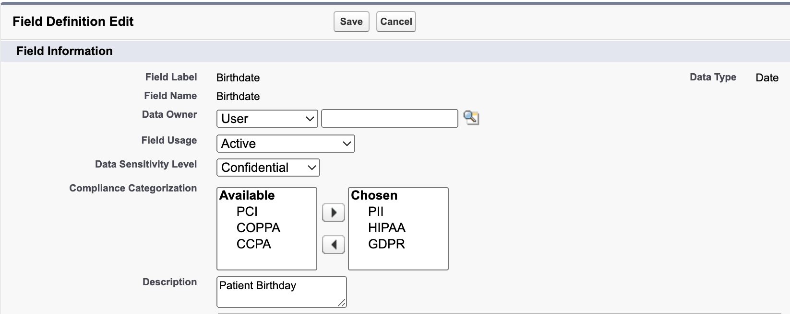
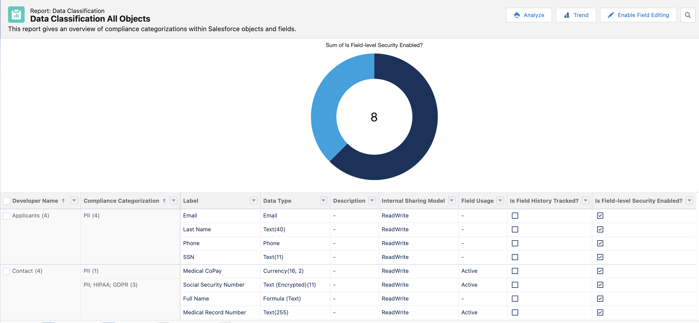
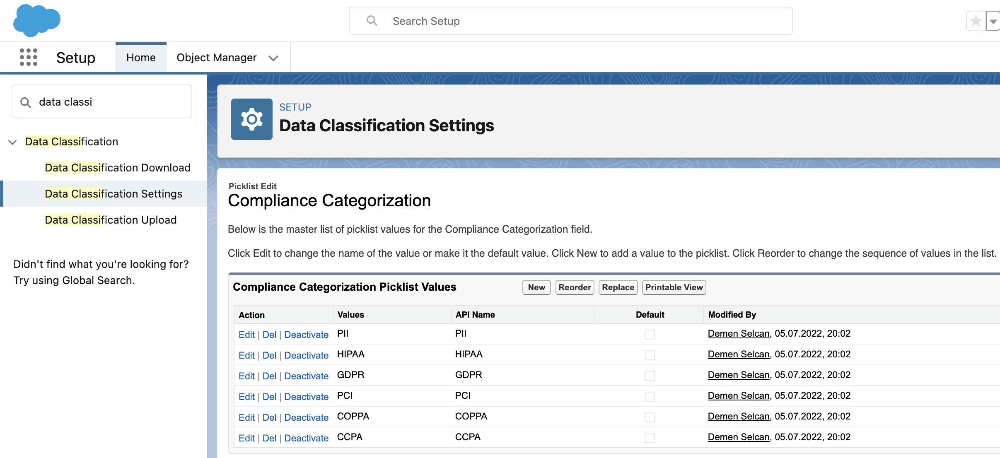

# Data Classification All Objects Report
Ever wondered what the data classification section in the fields settings is about?
 It's great news for restricted industries like Healthcare & Life Sciences or Finance. 

Data Classification Metadata lets you flag sensitive fields with the corresponding compliance category, data owner, field usage and sensitivity.
Best of all is that you can report on these classifications and even add your own values if needed.
If you don't want to spend ~15-20 mins to build such a report in your org (as described [here](https://help.salesforce.com/s/articleView?id=sf.data_classification_metadata_fields.htm&type=5 "Documentation")
), you can simply deploy my example report to your org with a click of a button. All it contains is a custom report type and an example report for Data Classification which can be filtered by object and classification type.

## Official Documentation
[Documentation - Data Classification Metadata Fields](https://help.salesforce.com/s/articleView?id=sf.data_classification_metadata_fields.htm&type=5 "Documentation")

### What this Report looks like

### Setting up your own values

## Pre-Requisites / Dependencies
Translation Workbench needs to be enabled in your org to install this report.

## Deploy this to your org
